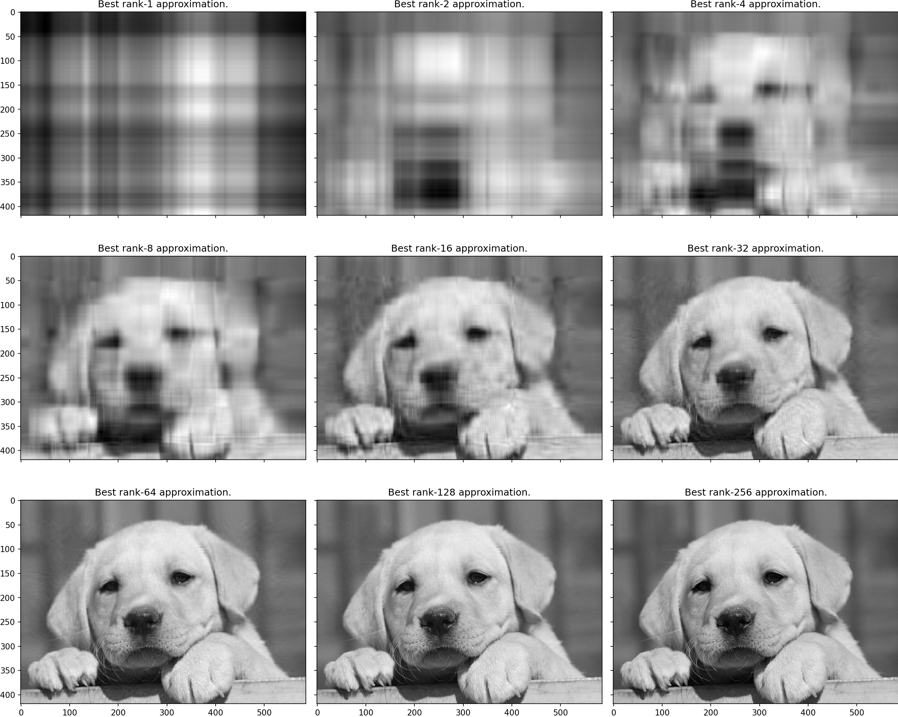

# SVD Image Compressor

Singular Value Decomposition (SVD) can be used for image compression, offering a balance between quality and file size. The tool supports both **grayscale** and **color** images and lets you adjust the compression level by varying the rank approximation.

##


## How SVD Works

Given an image matrix \( A \), the SVD decomposes it into three matrices:

\[
A = U &Sigma; V^T
\]

Where:
- \( U \) contains the left singular vectors,
- \( &Sigma; \) is the diagonal matrix of singular values,
- \( V^T \) contains the right singular vectors.

### Rank-k Approximation
We can compress the image by reconstructing it using only the first \( k \) singular values:



This reduces the size but retains most of the image's important features.

## How to Run

1. **Install dependencies**:
   ```bash
   pip install -r requirements.txt

2. **Run the compression**:
   ```bash
   python main.py --image data/test_cat.png --components 60